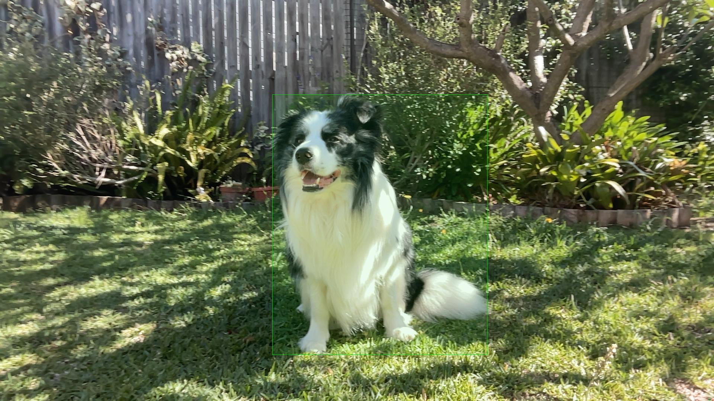

Object detection and image recognition using [detr-resnet-50](https://huggingface.co/facebook/detr-resnet-50) and a webcam. 

## Getting Started

1. `python3 -m venv myvenv`
2. `source myvenv/bin/activate`
3. `pip3 install -r requirements.txt`
4. `python3 main.py`

## Sample output
Terminal:
```bash
Detected dog with confidence 0.999 at location [857.24, 340.37, 1493.45, 1043.3]
Processed image saved as ./output/IMG_1700370043.jpg
```
Output folder:
